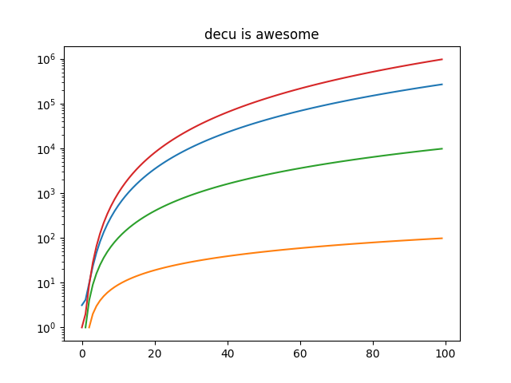

# Quick Start

If you're in a hurry and want to enjoy all the benefits from `decu` without
having to go through a two hour long lecture, this is the place for you.

## Installation

## Minimal Example

Now that you have `decu` installed in your (virtual) environment, here is
an example project. This example will showcase the three main sets of
functionality that `decu` provides: project organization, bookkeeping, and
inspection. It is best if you follow along this example by copying and
pasting the source code we show below in a temporary project.

#### Project organization: `decu init`

The first step is to get our file system set up to run an experimental
computation project. Navigate to an empty directory where your project is
going to live. Call this directory `root_dir`. Now execute

```
$ decu init
Initialized empty decu project directory in <root_dir>
```

`decu` follows a somewhat strict template of what a project filesystem
should look like, and with `$ decu init`, all we're doing is setting up
`root_dir` to reflect `decu`'s organization. If you now `ls` your
`root_dir` you will see something like the following.

```
root_dir
	src
	data
	logs
	pics
	results
```

The purpose of each directory created by `decu` is straightforward. The
`data` directory is assumed to contain raw or processed data files. The
`logs` directory will store the logs of running experiments. The `pics` and
`results` directories will hold plots, figures, and result files generated
by your `decu` scripts. The `src` directory will contain said scripts.

#### Project bookkeeping: `decu exec`

With this directory structure, we can now start coding our computational
experiments. Create a file `script.py` inside `root_dir/src` that contains
the following.

```python
import decu

class MyScript(decu.Script):
	@decu.experiment(data_param='data')
    def exp(self, data, param, param2):
        return [x**param + param2 for x in data]

    def main(self):
        data = range(100)
        result = self.exp(data, 2.72, 3.14)
```

In `script.py` we subclass `decu.Script`, define an experiment method
`exp`, and call it on some data from the `main` method. Note that the
method is decorated with `@decu.experiment` which requires us to specify
which of `exp`'s parameters is treated as the data input. All other
parameters are treated as 'experimental parameters'. More on experimental
parameters later. That's basically all that this code does.

What could we expect `decu` to do in this simple example? Bookkeeping! Note
that we didn't save the results of our experiment to disk, or used log
files or `print` calls to document what the script is doing. This was not
an oversight, it was on purpose. In fact, `decu` will do all of this for
us.

Before running the above script, the directory structure should look as
follows.

```
root_dir
	src
		script.py
	data
	logs
	pics
	results
```

--------------------------------------------------------------------------------
> **NOTE**: After having called `$ decu init` in `root_dir`, all successive
> calls to `decu` should be made from `root_dir` itself. That is, do not
> `cd` into `src/` and then call `decu`. All console commands from here on
> will be done from `root_dir`.
--------------------------------------------------------------------------------

##### Simple run

Now `cd` to `root_dir` again and run our script through `decu`.

```
$ decu exec src/script.py
```

After executing `script.py`, we can now take a look at what happened to
`root_dir`.

```
root_dir
	src
		script.py
	data
	logs
		log_file1--0.txt
	pics
	results
		result_file1--0.txt
```

Here, both `log_file1.txt` and `result_file1.txt` will have a name
including the date and time of execution and the name of the script that
generated these files, among other information.

This is (one of) the main features of `decu`. We needn't specify what
information we want to log, or the file name where we want to save our
experimental results. In fact, we didn't even need to manually save the
results to disk ourselves. `decu` will take care of the bookkeeping.

To see more specifically what `decu` saves to the log file, do

```
$ cat logs/log_file1.txt
[<time>]INFO: Starting exp--0 with {'param': 2.72, 'param2': 3.14}.
[<time>]INFO: Finished exp--0. Took 4e-05.
[<time>]INFO: Wrote results of exp--0 to results/result_file1.txt.
```

Since our script is very simple, `decu` just needed to log three
lines. However, you fill find there's a trove of information here. Without
writing a single line of logging or I/O code, we now have:

1. a unique file with a time-stamped recount of what our script did,
2. a record of the experimental parameters with which `exp` was called,
3. the time it took to run `exp`,
4. a file containing the results of running `exp` with the recorded
   parameters. This file contains in its name the name of the script and
   the function that generated its contents.

To understand why the `log_file1.txt` logs the call to `exp` as `exp--0`,
we need to modify `script.py` a little.

##### Multiple runs

```python
import decu

class MyScript(decu.Script):
	@decu.experiment(data_param='data')
    def exp(self, data, param, param2):
        return [x**param + param2 for x in data]

    def main(self):
        data = range(100)
        result = self.exp(data, 2.72, 3.14)
		params = [(data, x, y) for x, y in zip([1, 2, 3], [-1, 0, 1])]
	    result2 = decu.run_parallel(self.exp, params)
```

We have included further experiments now. We are calling the same method
`exp` but with a different choice of parameters each time.
`decu.run_parallel(method, params)` will call `method(*l)` for each element
`l` in `params`, and it will do so by using Python's `multiprocessing`
library, which means that these experiments will be run in parallel.

To execute this new version, we do

```
$ decu exec src/script.py
```

First of all, take a look at the current state of `root_dir`, after a
second run our script.

```
root_dir
	src
		script.py
	data
	logs
		log_file1.txt
		log_file2.txt
	pics
	results
		result_file1--0.txt
		result_file2--0.txt
		result_file2--1.txt
		result_file2--2.txt
		result_file2--3.txt
```

Here's what happened: `decu` created a new log file for this second
experimental run, `log_file2.txt`. It also generated one result file for
each of the experiments we ran. To understand the contents of the new
result files, we need only read the new log file. (Your output maybe
slightly different in the order of the lines.)

```
$ cat logs/log_file2.txt
[<time>]INFO: Starting exp--0 with {'param': 2.72, 'param2': 3.14}.
[<time>]INFO: Finished exp--0. Took 0.0004s.
[<time>]INFO: Wrote results of exp--0 to results/2017-10-20 18:21:28.374962--script--exp--0.txt.
[<time>]INFO: Starting exp--2 with {'param': 2, 'param2': 0}.
[<time>]INFO: Starting exp--1 with {'param': 1, 'param2': -1}.
[<time>]INFO: Starting exp--3 with {'param': 3, 'param2': 1}.
[<time>]INFO: Finished exp--2. Took 4e-05s.
[<time>]INFO: Finished exp--1. Took 5e-05s.
[<time>]INFO: Finished exp--3. Took 6e-05s.
[<time>]INFO: Wrote results of exp--2 to results/2017-10-20 18:21:28.374962--script--exp--2.txt.
[<time>]INFO: Wrote results of exp--1 to results/2017-10-20 18:21:28.374962--script--exp--1.txt.
[<time>]INFO: Wrote results of exp--3 to results/2017-10-20 18:21:28.374962--script--exp--3.txt.
```

The first three lines are familiar. They correspond to the call to `exp`
that we had before, and they provide similar information. We now know that
`result_file2.txt` contains the result of running `exp` with parameters
`{'param': 2.72, 'param2': 3.14}`. Then we used `run_parallel` to run `exp`
over a list of parameters, and we get the last nine lines, which contain
similar information as before, but for the three additional times we called
`exp`. Observe that each time we call `exp`, the log file includes two
dashes followed by a number, `--x`. This is a way for identifying different
calls to the same experiment, and serves to tell which result file belongs
to which experiment call. Note that the result files also contain the same
identifier at the end. Without this identifier, our result files would all
overwrite each other, or else there would be no way to tell which contains
the result of which experiment call. In the example above, we need only
match the identifier of a result file name with the experiment identifiers
in log file, to know

1. the method that generated the result file,
2. the time it took to generate the file, and
3. the experimental parameters that were used to generate it.

In other words, with these identifiers we can cross-reference results and
experiment runs by using the log file. The run identifiers are guaranteed
to be unique for each call to `exp`, even when using parallelism with
`run_parallel`.

Oh, never mind the fact that we just used multiprocessing to run our
experiments in parallel, with no additional imports and in a single call of
`run_parallel`.

##### Figures

So now `decu` is handling logging, directory bookkeeping, cross-referencing
experimental parameters and results, and parallelism, in 12 lines of
python (two of each are empty BTW). But there's more!

Say now that you want to plot a pretty picture from your results. Enter the
`@figure` decorator, used in the following version of `script.py`.

```python
import decu
import matplotlib.pyplot as plt

class MyScript(decu.Script):
    @decu.experiment(data_param='data')
    def exp(self, data, param, param2):
        return [x**param + param2 for x in data]

    @decu.figure()
    def fig(self, data, results):
        for res in results:
            plt.semilogy(data, res)

    def main(self):
        data = range(100)
        result = self.exp(data, 2.72, 3.14)
        params = [(data, x, y) for x, y in zip([1, 2, 3], [-1, 0, 1])]
        result2 = decu.run_parallel(self.exp, params)
        self.fig(data, result2)
```

After importing `matplotlib`, we have added the `fig` method, which we have
decorated with `@decu.figure()`, and we call at the end of `main`.

You know the drill now:

```
$ decu exec src/script.py
```

The `root_dir` should now look as follows.

```
root_dir
	src
		script.py
	data
	logs
		log_file1.txt
		log_file2.txt
		log_file3.txt
	pics
		fig_file1.png
	results
		result_file1--0.txt
		result_file2--0.txt
		result_file2--1.txt
		result_file2--2.txt
		result_file2--3.txt
		result_file3--0.txt
		result_file3--1.txt
		result_file3--2.txt
		result_file3--3.txt
```

As before, we get our log file `log_file3.txt` and four result files. We
also get out plot inside `pics/`. "But wait!"-I hear you say-"we never
saved the plot to disk!" Exactly. You can open this file to convince
yourself of how wonderful `decu` is.


You can also read the log file to see that it mentions which method
(`fig`) generated the new figure file.

#### Project debugging: `decu inspect`

Oh, darn. We forgot to add a title to our plot. After we have modified our
`fig` function to include a nice title, we can generate the new plot in a
number of ways. First, we can modify the `fig` method and run the whole
thing again. This becomes increasingly cumbersome (and sometimes outright
impossible) if `exp` takes too long to run, as it often does in real
life. Second, since we have the result file, we can pop into a python
interpreter, read the result from disk, and call `fig` again. This would
require us to not only load the result, but the file `script.py` and
instantiate the class `MyScript`. How tedious.

OR, we can use `decu` to do exactly that.

```
$ decu inspect results/result_file3*
import decu
import numpy as np
import src.script as script
script = script.MyScript('root_dir', 'script')
# loaded files in variable result

In [1]: data = range(100)

In [2]: script.fig(data, result)

In [2]: exit
```

Another possibility is:

```
$ decu inspect result_dict=results/result_file3* data=data/data_file1.txt
import decu
import numpy as np
import src.script as script
script = script.MyScript('/tmp/root_dir', 'script')
# loaded results/result_file3* in result_list
# loaded data/data_file1.txt in data

In [1]: script.fig(data, result_dict.values())

In [2]: exit
```

And the final result is:




#### Summary

#### Cheat Sheet
